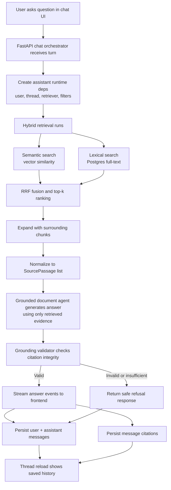

# Assistant Module

This package powers the grounded answering flow: search planning, retrieval-backed generation, citation validation, and safe refusal behavior.

## Full Pipeline (Plain English)

1. The user asks a question in chat.
2. The backend receives the turn and creates runtime dependencies (user id, thread id, retriever, and filters).
3. The retriever runs hybrid search:
	- semantic search (embedding similarity)
	- lexical search (full-text)
	- reciprocal-rank fusion to combine both
	- optional neighbor chunk expansion for local context
4. Retrieved passages are normalized into `SourcePassage` objects.
5. The grounded document agent is called with:
	- the user question
	- retrieved evidence passages
	- citation rules from `instructions.md`
6. The model produces a `GroundedAnswer` with citation objects.
7. The grounding validator checks that citations are valid and map to retrieved evidence.
8. If validation fails or retrieval/model execution fails, the assistant returns a safe insufficient-evidence refusal.
9. The orchestrator streams the assistant text response to the frontend via AI SDK event protocol.
10. The turn is persisted to storage, including citations when available.

## Pipeline Diagram

## Module Map

- `agent.py`: agent factory and grounded answer flow.
- `deps.py`: runtime dependency container passed into tools.
- `depths.py`: search-depth presets.
- `instructions.md`: grounding behavior and policy contract.
- `outputs.py`: structured output models (`GroundedAnswer`, `Citation`, `SourcePassage`).
- `progress.py`: progress tracking for assistant planning.
- `tools.py`: search-term extraction and FTS query term building.
- `__init__.py`: package exports.
- `init.py`: compatibility shim for `assistant.init` imports.

## Notes

- The visual graph above renders in Markdown viewers that support Mermaid (including VS Code Markdown preview).
- If you need an exported image file (PNG/SVG), render this Mermaid block and export it from the preview tooling.
